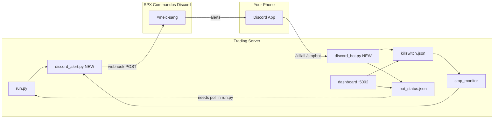

# Discord Integration — SPX Commandos `#meic-sang`

**Date**: Jun 22, 2026  
**Status**: Design / evaluation — not implemented yet  
**Channel**: `#meic-sang` on Discord server **SPX Commandos**  
**Related**: [OPERATIONAL_HARDENING.md](OPERATIONAL_HARDENING.md), [DASHBOARD_IMPLEMENTATION.md](DASHBOARD_IMPLEMENTATION.md), [VPS_DASHBOARD_ACCESS.md](VPS_DASHBOARD_ACCESS.md), [README.md](../README.md)

---

## Executive Summary

| Question | Answer |
|----------|--------|
| Does `spx-bot-main` have Discord integration? | **No.** No Discord, Slack, Telegram, or webhook code exists in that repo. Alerts there are email-only stubs in `common/monitoring.py`. |
| Does `MEIC-with-Dash-main` have Discord integration? | **No.** It has **Slack webhook stubs** (`slack_alert.py` in three places) with **empty URLs** — they silently skip. |
| Can Discord receive MEIC alerts today? | **Not without new work.** Discord webhooks are Slack-compatible for outbound messages; that is the fastest path. |
| Can you Kill All / Stop Bot from mobile Discord today? | **Not without a Discord Bot process** on the trading server. Webhooks are one-way (outbound only). |

**Recommended architecture**: two pieces on the trading server:

1. **Outbound** — Discord **webhook** on `#meic-sang` for crucial trade/ops alerts (reuse existing `alert_notification` pattern).
2. **Inbound** — small **Discord Bot** (slash commands or restricted text commands) that writes the same sentinel files the dashboard uses — no need to expose the dashboard to the internet.

---

## Evaluation: `spx-bot-main`

Searched the full tree (`strategies/`, `common/`, `flask_app/`, `deleted/`). Findings:

| Area | What exists |
|------|-------------|
| Notifications | `common/monitoring.py` — `PerformanceMonitor` with optional **email** (`AlertConfig.email_enabled`) |
| Web UI | Flask on-demand GEX / strategy monitor — local only |
| Kill / stop | `readme.md` mentions `pkill -f main.py` — no remote control layer |
| Mobile | README notes Termux/local use — not Discord |

`spx-bot-main` is a separate GEX / SPX 9IF analysis stack. It is **not** wired to MEIC trading, kill switches, or SPX Commandos. Any Discord work for live MEIC ops belongs in **`MEIC-with-Dash-main`**, not `spx-bot-main`.

---

## Evaluation: `MEIC-with-Dash-main` (what matters for ops)

### Existing alert hooks (Slack-shaped, unused)

| File | Purpose |
|------|---------|
| `meic0dte/slack/slack_alert.py` | Trade execution alerts (`CHANNEL = "#schwab-meic"`) |
| `streaming/slack_alert.py` | Streamer alerts |
| `common/auth/slack_alert.py` | Auth/token alerts |

All read `SLACK_WEBHOOK_URL` from their local `config.py` — currently `''`.

**Discord compatibility**: Discord incoming webhooks accept the same JSON shape Slack uses (`content`, `embeds`, `username`). Point `SLACK_WEBHOOK_URL` at a Discord webhook URL and messages land in `#meic-sang` with minimal code change — ideally rename to a shared `common/discord_alert.py` later.

### Existing remote-control surfaces (dashboard)

The dashboard at `http://127.0.0.1:5002` already implements the actions you want:

| Action | API | What it does on server |
|--------|-----|------------------------|
| **Kill All Positions** | `POST /api/killswitch` | Writes `meic0dte/trades/killswitch.json` → `stop_monitor` force-closes all active trades within ~3s (`close_mechanism: admin_killswitch`) |
| **Stop Bot** | `POST /api/stop_bot` | Writes `dashboard/bot_status.json` with `state: kill`; terminates dashboard-spawned `run.py` only |
| **Kill Selected** | `POST /api/close_trade` + `POST /api/pause_tranches` | Per-trade close command files |
| **Pause tranches** | `POST /api/pause_tranches` | Writes `meic0dte/trades/pause_tranches.json` |

**Important gap (documented in [OPERATIONAL_HARDENING.md](OPERATIONAL_HARDENING.md))**: When `run.py` is started **externally** (normal production: `uv run python run.py`), **Stop Bot from the dashboard does not terminate the launcher** — it only updates `bot_status.json`. The main loop in `run.py` does **not** yet poll for `state: kill`. **Kill All Positions still works** because `stop_monitor` is independent and reads `killswitch.json`.

For mobile Discord control, the bot should either:

- Write sentinel files directly (best), and/or
- Add a `run.py` poll for `bot_status.json` `state == 'kill'` (small fix, aligns with [DASHBOARD_IMPLEMENTATION.md](DASHBOARD_IMPLEMENTATION.md) intent).

### Legacy MQTT kill switch

`meic0dte/meickillswitch.py` publishes `True` to MQTT topic `TASTYTRADE/MEIC_Close_All`. The TastyTrade path primarily uses file-based `killswitch.json` via `stop_monitor`. Prefer the **file sentinel** for Discord commands — same as the dashboard.

---

## Target Architecture



---

## Part 1 — Outbound Alerts to `#meic-sang`

### Discord setup (one-time, in Discord app)

1. Open **SPX Commandos** → `#meic-sang` → channel settings → **Integrations** → **Webhooks**.
2. **New Webhook** → name it `MEIC Ops` → copy webhook URL.
3. Store URL in server env or secrets — **never commit to git**:

```powershell
# Windows server — user or system env
setx DISCORD_WEBHOOK_MEIC_SANG "https://discord.com/api/webhooks/...."
```

### Minimal alert module (proposed)

Create `common/discord_alert.py`:

```python
import json, os, requests

WEBHOOK_URL = os.environ.get("DISCORD_WEBHOOK_MEIC_SANG", "")

def alert(title: str, message: str, *, color: int = 0x3498DB, mention: bool = False):
    if not WEBHOOK_URL:
        return
  payload = {
        "username": "MEIC Ops",
        "embeds": [{
            "title": title,
            "description": message,
            "color": color,
        }],
    }
    if mention:
        payload["content"] = "@here"  # or a specific role ID
    requests.post(WEBHOOK_URL, json=payload, timeout=10)
```

Wire into existing call sites by replacing or wrapping `meic0dte/slack/slack_alert.alert_notification`.

### Crucial events to send (priority order)

| Priority | Event | Suggested color | When to fire |
|----------|-------|-----------------|--------------|
| P0 | **Kill switch executed** | Red | `killswitch.json` written (dashboard, Discord, or manual) |
| P0 | **Breach / force close** | Orange | `stop_monitor` starts limit-chase close (`software_breach`, `admin_killswitch`) |
| P0 | **Streamer / stop_monitor crash** | Red | `run.py` health restart loop fires |
| P1 | **Trade filled** | Green | `app_main` / fill path completes |
| P1 | **Tranche skipped** | Yellow | Paused slot, FOMC/holiday skip, VIX gate |
| P1 | **Daily start / stop** | Blue | Launcher `running` / `stopped` / 3 PM shutdown |
| P2 | **Phase 2 / 3 upgrade** | Yellow | Stop engine phase transitions |
| P2 | **Order errors** | Red | Already calls `slack_alert` in `order/order.py` |
| P2 | **End-of-day summary** | Blue | 3 PM — open count, day PnL from dashboard DB |

**Rate limiting**: Use a 60–120s cooldown for repeated errors (same pattern as `PerformanceMonitor.alert_cooldown` in `spx-bot-main/common/monitoring.py`) so a stuck loop does not spam `#meic-sang`.

### Example messages

```
🟢 TRADE OPENED — 11-00 Call
Credit: $1.45 | Short 5850 / Long 5825 | Qty 1
SPX: 5842 | Stop: $3.20

🔴 KILL ALL — admin_killswitch
3 active trades → force-close started
Source: discord | 12:14:03 CT

🟠 BREACH — 12-00 Put
Spread mid 3.25 ≥ stop 3.00 → limit chase active

⚫ BOT STOPPED
Launcher shutdown at 15:00 CT | 0 open positions
```

---

## Part 2 — Mobile Commands (Kill All / Stop Bot)

Webhooks **cannot** receive commands. You need a **Discord Bot** running on the trading server.

### Discord setup (one-time)

1. [Discord Developer Portal](https://discord.com/developers/applications) → **New Application** → name `MEIC Commander`.
2. **Bot** tab → create bot → copy **token** (store in env: `DISCORD_BOT_TOKEN`).
3. **OAuth2 → URL Generator** → scopes: `bot`, `applications.commands` → permissions: `Send Messages`, `Read Message History` (minimal).
4. Invite bot to **SPX Commandos**.
5. In `#meic-sang` → channel permissions: only you (and the bot) can post; restrict who can invoke commands.

### Recommended: slash commands

| Command | Action | Server-side effect |
|---------|--------|-------------------|
| `/status` | Read-only | Posts: launcher state, open trades count, SPX, stop_monitor heartbeat age |
| `/killall` | **Kill All Positions** | Write `meic0dte/trades/killswitch.json` (same JSON as dashboard) |
| `/stopbot` | **Stop Bot** | Write `dashboard/bot_status.json` `state: kill` + optional `run.py` SIGTERM |
| `/pause` | Pause pending tranches | Append slots to `pause_tranches.json` |
| `/pnl` | Snapshot | Query dashboard `GET /api/summary` locally or read trade JSONs |

### Security requirements (non-negotiable)

| Control | Why |
|---------|-----|
| **User ID allowlist** | Only your Discord user ID can run `/killall` and `/stopbot` |
| **Guild ID lock** | Bot only responds in SPX Commandos server ID |
| **Channel ID lock** | Commands only in `#meic-sang` |
| **Confirmation for destructive cmds** | `/killall` → bot replies "Reply `CONFIRM KILL` within 30s" |
| **Audit log** | Bot posts who ran what + timestamp to channel |
| **Secrets in env** | `DISCORD_BOT_TOKEN`, `DISCORD_WEBHOOK_MEIC_SANG` — not in repo |

### Proposed bot skeleton (`discord_bot.py` at project root)

```python
# discord.py + app_commands
# Runs alongside run.py (separate process or systemd service)

KILL_PATH = "meic0dte/trades/killswitch.json"
STATUS_PATH = "dashboard/bot_status.json"
ALLOWED_USER_IDS = {123456789012345678}  # your Discord user id

def write_killswitch(source="discord"):
    os.makedirs(os.path.dirname(KILL_PATH), exist_ok=True)
    with open(KILL_PATH, "w") as f:
        json.dump({
            "action": "kill_all",
            "close_mechanism": "admin_killswitch",
            "ts": "...",
            "source": source,
        }, f)

def write_stop_bot(source="discord"):
    with open(STATUS_PATH, "w") as f:
        json.dump({"state": "kill", "reason": f"Stopped via {source}", "ts": "..."}, f)
    # Optional: find run.py PID and terminate (see below)
```

**Kill All** path is production-ready today via `stop_monitor/monitor.py`.

**Stop Bot** needs one of:

- **Option A (recommended)**: Add to `run.py` main loop (every 5s):

```python
status = read_json_safe(STATUS_FILE) or {}
if status.get('state') == 'kill':
    log.info('Kill signal in bot_status.json — shutting down.')
    break
```

- **Option B**: Bot finds `run.py` process and sends SIGTERM (works but cruder).

### Mobile usage flow

1. Open Discord on phone → **SPX Commandos** → `#meic-sang`.
2. Type `/killall` → confirm → bot writes sentinel → within ~3s all positions force-close.
3. Type `/stopbot` → launcher exits at next poll; **open positions keep exchange stops** (same as dashboard Stop Bot).
4. Alerts for fills, breaches, and confirmations appear in the same channel.

---

## Part 3 — Alternative Paths (no custom bot)

| Approach | Pros | Cons |
|----------|------|------|
| **Tailscale / VPN + mobile browser** | Zero new code; use dashboard buttons | Must open tunnel; dashboard on `127.0.0.1` |
| **Cloudflare Tunnel** to dashboard | Full UI on phone | Exposes HTTP — needs auth (basic auth, Cloudflare Access) |
| **Telegram bot** | Similar to Discord bot; mentioned in SERVER-SETUP-PROMPT | You already use SPX Commandos Discord |
| **MQTT publish from phone** | `meickillswitch.py` pattern | Needs MQTT client on phone; less friendly UX |
| **SSH + script on phone** (Termux) | Direct | High friction, easy to mistype |

**Best balance for SPX Commandos**: Discord webhook (alerts) + Discord bot (commands) on the same `#meic-sang` channel.

---

## Implementation Plan

### Phase 1 — Alerts only (~2 hours)

1. Create Discord webhook on `#meic-sang`.
2. Add `common/discord_alert.py`.
3. Set `DISCORD_WEBHOOK_MEIC_SANG` on server.
4. Hook P0/P1 events: launcher start/stop, killswitch, breach, fill.
5. Test with a manual `alert("Test", "Hello from MEIC")`.

### Phase 2 — Mobile kill switch (~4 hours)

1. Create Discord application + bot; invite to SPX Commandos.
2. Add `discord_bot.py` with `/killall`, `/status`; user ID allowlist.
3. Run as Windows service or `nohup` alongside `run.py`.
4. Test in **paper mode** first.

### Phase 3 — Stop bot + hardening (~2 hours)

1. Add `bot_status.json` poll to `run.py` main loop.
2. Add `/stopbot` with confirmation.
3. Add crash-restart notifications from launcher health checks.
4. EOD summary cron or 3 PM hook.

### Phase 4 — Polish

- Consolidate three `slack_alert.py` copies into one `discord_alert.py`.
- Dashboard button → also post to Discord ("Kill All triggered from dashboard").
- Optional: role pings (`@MEIC-Ops`) on P0 only.

---

## Configuration Checklist

| Item | Where |
|------|-------|
| Discord webhook URL | Env: `DISCORD_WEBHOOK_MEIC_SANG` |
| Discord bot token | Env: `DISCORD_BOT_TOKEN` |
| Your Discord user ID | `ALLOWED_USER_IDS` in `discord_bot.py` |
| Guild ID (SPX Commandos) | `ALLOWED_GUILD_ID` |
| Channel ID (`#meic-sang`) | `ALLOWED_CHANNEL_ID` |
| Python dependency | `discord.py` (or `py-cord`) — add to `requirements.txt` / `pyproject.toml` |

**Get IDs**: Discord → Settings → Advanced → Developer Mode → right-click server / channel / yourself → Copy ID.

---

## Files to Touch (when implementing)

| File | Change |
|------|--------|
| `common/discord_alert.py` | **New** — shared webhook sender |
| `discord_bot.py` | **New** — slash commands, allowlist |
| `run.py` | Poll `bot_status.json` for `kill` |
| `meic0dte/slack/slack_alert.py` | Call `discord_alert` or replace |
| `stop_monitor/monitor.py` | Alert on breach / killswitch detection |
| `dashboard/server.py` | Optional: notify Discord when dashboard triggers kill/stop |
| `requirements.txt` / `pyproject.toml` | `discord.py`, `requests` |

**Do not modify** `spx-bot-main` for MEIC ops unless you later unify repos.

---

## Quick Reference — Sentinel File Formats

**Kill All** (`meic0dte/trades/killswitch.json`):

```json
{
  "action": "kill_all",
  "close_mechanism": "admin_killswitch",
  "ts": "12:14:03 CT",
  "source": "discord"
}
```

**Stop Bot** (`dashboard/bot_status.json`):

```json
{
  "state": "kill",
  "reason": "Stopped via discord",
  "ts": "12:14:03 CT"
}
```

**Pause tranche** (`meic0dte/trades/pause_tranches.json`):

```json
{
  "paused_slots": ["01-15_C", "01-15_P"],
  "ts": "12:14:03 CT"
}
```

---

## Summary

- **`spx-bot-main`**: no Discord integration; unrelated to MEIC kill switch.
- **`MEIC-with-Dash-main`**: ready **control plane** (dashboard APIs + sentinel files); **no notifications** until webhooks are configured.
- **`#meic-sang`**: use a **Discord webhook** for outbound crucial updates and a **Discord bot** for inbound `/killall` and `/stopbot` from your phone.
- **Kill All works today** via `killswitch.json`; **Stop Bot** needs a small `run.py` poll fix to match dashboard behavior when launcher is started externally.

Next step when you want implementation: Phase 1 (webhook alerts) can ship in one session without touching trading logic.
