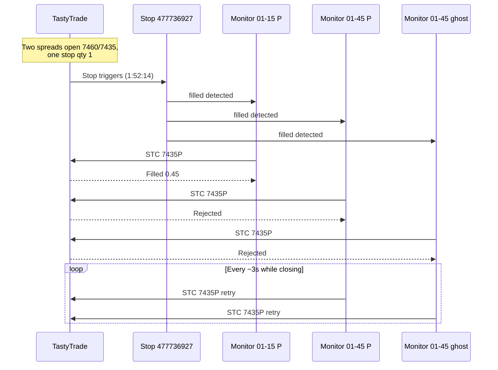

# Incident Report: Shared Stop Adoption & Long-Close Order Storm

**Date**: Jun 22, 2026 (production session)  
**Status**: **P0 — fix before next live session**  
**Audience**: Operators and dev  
**Evidence**: `tastytrade_activity_260622.csv`, `meic0dte/trades/active/*.json`, `meic0dte/logs/01-45_*.log`  
**Related**: [GAP_ANALYSIS.md](GAP_ANALYSIS.md) (GAP-01, GAP-03, GAP-14), [OPERATIONAL_HARDENING.md](OPERATIONAL_HARDENING.md)

---

## Executive Summary

Two related failures occurred late in the Jun 22 session. Both stem from **the same underlying design flaw**: the bot treats **broker stop orders as owned by a single trade JSON**, but TastyTrade stop orders are keyed only by **short-leg symbol**, not by tranche/lot.

| # | Symptom | Root cause (one line) |
|---|---------|------------------------|
| **1** | 01-45 tranche: Call got its own exchange stop; Put did not | `adopt_active_stop_from_broker()` linked 01-45 put JSON to the **existing** 01-15 put stop on the same 7460P short — no second stop placed |
| **2** | Stop #477736927 filled once; ~40 rejected STC orders on 7435P followed | **Three** trade JSON files shared stop #477736927; each monitor fired long-close logic independently; `handle_stop_order_update()` is **not idempotent** |

Morning fixes (leg fill parsing, fill sync) worked — five stops were live by ~1:33 PM. These afternoon failures are **new** and independent of the morning `fill_price: 0.0` bug.

---

## Timeline (Central)

| Time | Event | Source |
|------|-------|--------|
| 1:14 PM | 01-15 put opens **7460/7435** (order #477726653) | CSV line 66–67 |
| 1:14 PM | 01-15 call opens **7490/7515** (order #477726680) | CSV line 64–65 |
| 1:33 PM | Stop **#477736927** placed on **7460P** for 01-15 put (STP 2.35 / LMT 2.45) | JSON `0115_P_726653` |
| 1:44 PM | 01-45 call opens **7490/7515** (order #477742196) | CSV line 54–55 |
| 1:44 PM | New stop **#477742226** placed on **7490C** (STP 2.45 / LMT 2.55) | JSON `0145_C_742196` |
| 1:44 PM | 01-45 put attempt #1 **7460/7435** cancelled (order #477742173) | CSV line 52–53 |
| 1:44 PM | 01-45 put opens **7460/7435** (order #477742279) — **same strikes as 01-15 put** | CSV line 50–51 |
| 1:44 PM | 01-45 put JSON **adopts** stop #477736927 instead of placing a new stop | JSON `adopted_from_broker: true` |
| 1:52:14 PM | Stop **#477736927 fills** — 1× 7460P BTC @ $2.30 | CSV line 49 |
| 1:52:17 PM | Long close **#477746038 fills** — 1× 7435P STC @ $0.45 | CSV line 48 |
| 1:52:55 – 1:55:03 PM | **~40 rejected** STC orders on **7435P** (0.60–0.85 cr) | CSV lines 11–46 |
| 1:55:56 PM | Kill chaos: stops cancelled (#477742226 call, others) | CSV lines 7–10 |

---

## Issue 1 — 01-45 Put Did Not Get Its Own Exchange Stop

### What the operator saw

At the **01-45 tranche**, a new stop appeared at the brokerage for the **call** side (7490C, order #477742226). The **put** side did not get a newly placed stop — it appeared to share protection with an earlier tranche.

### What actually happened

Both tranches opened the **identical put spread**:

| Lot | Put spread | Open order | Stop at broker |
|-----|------------|------------|----------------|
| 01-15 | 7460 / 7435 | #477726653 | **#477736927** placed fresh (qty 1) |
| 01-45 | 7460 / 7435 | #477742279 | **Adopted #477736927** — no new order |

Call side at 01-45 **did** get a fresh stop because the 01-15 call had already been manually archived (no working stop on 7490C remained):

| Lot | Call spread | Stop at broker |
|-----|-------------|----------------|
| 01-15 | 7490 / 7515 | None (manual archive earlier) |
| 01-45 | 7490 / 7515 | **#477742226** placed fresh |

### Code path

When stop_monitor picks up a new put JSON (`0145_P_742279.json`), `_ensure_stop_for_filled_qty()` → `_adopt_broker_stop_if_needed()` runs before placing a new stop:

```python
# stop_monitor/broker_sync.py — adopt_active_stop_from_broker()
result = finder(state['short_leg']['symbol'])  # finds ANY live BTC on 7460P
# ... copies order_id into THIS trade's JSON without checking other active trades
```

`find_working_close_order()` matches on **short symbol only** — not lot, not open order, not quantity owed across spreads.

### Impact

- **Two open put spreads** (01-15 + 01-45) on 7460/7435
- **One exchange stop** for qty **1** on 7460P
- Second spread was **unprotected at the brokerage** — only software breach monitoring (if MQTT + status=`open`) could have closed it
- Operator belief: “put stop didn’t execute” — physically correct that **only one** of two put spreads could be stopped by a single qty-1 order

### Contributing factors

1. **Duplicate strikes across tranches** — MEIC can re-select the same short/long strikes in consecutive lots when SPX hasn’t moved much.
2. **Adopt logic intended for re-seed/testing** (`adopted_existing_broker_stop`) is unsafe in production when multiple spreads share a short leg.
3. **Ghost JSON** `0145_P_742173.json` (cancelled open attempt) also adopted stop #477736927 while still in `trades/active/` — a third watcher on the same stop.

---

## Issue 2 — Long-Close Order Storm on 7435 Put (Stop #477736927)

### What the operator saw

Stop **#477736927** filled correctly on the 7460P short (~1:52:14 PM). One long-leg close on **7435P** filled three seconds later (#477746038 @ $0.45). Then the brokerage received **dozens** of additional SELL_TO_CLOSE orders on **7435P**, all **rejected** (“insufficient buying power” / would imply selling long already closed → naked short risk).

Operator had to kill the process and manually manage remaining puts.

### Broker evidence

From `tastytrade_activity_260622.csv`:

| Orders | Count | Result |
|--------|-------|--------|
| #477746038 | 1 | **Filled** STC 7435P @ $0.45 (1:52:17 PM) |
| #477747189 – #477747781 | **~40** | **Rejected** STC 7435P @ $0.60–$0.85 (1:52:55 – 1:55:03 PM) |

Rejections arrived roughly **every 3 seconds** — matches stop_monitor fast poll interval.

### Root cause: one stop order, multiple trade monitors

Stop **#477736927** was referenced in **three** active JSON files:

| JSON file | Lot | Status at incident | `active_stop.order_id` |
|-----------|-----|-------------------|------------------------|
| `0115_1314_P_726653.json` | 01-15 | `closing` → had close record | 477736927 (placed) |
| `0145_1344_P_742279.json` | 01-45 | `closing` | 477736927 (adopted) |
| `0145_1344_P_742173.json` | 01-45 | `pending_fill` (ghost) | 477736927 (adopted) |

Each file had its **own stop_monitor thread**. When the single physical stop filled:

1. **All three** detected `status=filled` on order #477736927 (REST poll, alert queue, and/or `_on_load` after restarts).
2. Each called `handle_stop_order_update()` → `_close_long_leg()` → new STC limit on **7435P qty 1**.

Only the **first** long close could succeed (long qty was 1 per spread, but same symbol 7435P). Subsequent orders tried to sell long that was already gone → broker rejected.

### Root cause: non-idempotent stop-fill handler

```python
# stop_monitor/monitor.py — handle_stop_order_update()
def handle_stop_order_update(self, stop):
    if str(stop.get('status', '')).lower() != 'filled':
        return
    # NO CHECK: if self.state.get('status') in ('closing', 'closed'): return
    # NO CHECK: if long_close_order_id already set
    self._close_long_leg()   # places ANOTHER broker order every call
    self.state['status'] = 'closing'
```

The 01-15 put JSON records **five** duplicate `stop_filled` events in `stop_history` (1:52:16 – 1:54:49 PM) — same order id, same reason — proving repeated invocations on **one** monitor alone.

Entry points that can re-fire:

| Entry point | When |
|-------------|------|
| `_sync_active_close_order()` | REST poll every 60s while `status=open` |
| `_drain_fill_queue()` | AlertListener push (can duplicate) |
| `_on_load()` | Monitor restart (`module_start_count: 6` on 01-15 put) |
| Phase1 `handle_stop_order_update` | Stop status edge cases |

### Root cause: long chase retry on failed placement

After first successful long fill (#477746038), other monitors still in `closing` with `long_close_order_id: null`:

```python
# _chase_long_close()
if not oid:
    self._place_long_close_at_mid()   # retry forever every ~30s + 3s poll
```

When `place_limit_order` is **rejected**, `long_close_order_id` is **not** set → next cycle tries again → rejection storm. Broker message (“insufficient buying power”) is misleading; the real issue is **no long left to sell**.

### Sequence diagram



---

## What Was NOT the Cause

| Ruled out | Why |
|-----------|-----|
| Morning leg-fill parser bug | Fixed before 1:33 PM; stops were placed and live |
| Broker stop rejection | Stop #477736927 filled normally |
| Long chase “working as designed” alone | Chase reprices **one** working order; this was **dozens of new** orders from **multiple monitors** + idempotent gap |
| Dashboard Kill Selected | Cancellations at 1:55 PM were **after** the STC storm (1:52–1:55) |

---

## Operator Impact (Jun 22)

- **Unprotected put spread** after 01-45 open (second 7460/7435 with no dedicated stop).
- **Panic/confusion** when brokerage showed rapid-fire rejected orders on 7435P.
- **Manual takeover**: process stopped; stops cancelled manually on remaining puts; spreads closed by hand (CSV shows manual spread closes #477748476, #477748586 at ~1:56 PM).
- **Stale state on disk**: several JSON files still in `trades/active/` with `closing` / `pending_fill` — must be cleaned before next restart (see cleanup checklist below).

---

## Recommended Fixes (Priority Order)

### P0 — Must fix before next live day

| ID | Fix | Files |
|----|-----|-------|
| **P0-A** | **Idempotent stop fill**: `handle_stop_order_update()` return immediately if `status in ('closing', 'closed')` or if `short_close_price` already set | `stop_monitor/monitor.py` |
| **P0-B** | **One broker stop → one owner**: maintain registry `order_id → json_path`; refuse adopt if stop already owned by another active trade | `stop_monitor/broker_sync.py`, `runner.py` |
| **P0-C** | **Never adopt blindly in production**: when opening a new spread, always **place** a new stop (or **resize** existing stop qty to sum of open spreads on that short symbol) — do not copy another trade’s order id | `broker_sync.py`, `monitor.py` |
| **P0-D** | **Long close guard**: before `SELL_TO_CLOSE`, verify long position qty at broker > 0; if flat, skip placement and finalize or sync state | `monitor.py`, `tastytrade_broker.py` |
| **P0-E** | **Reject storm backoff**: on long-close rejection, set flag + exponential backoff; do not fire every 3s | `monitor.py` |

### P1 — Strongly recommended

| ID | Fix | Notes |
|----|-----|-------|
| **P1-A** | Detect duplicate short strikes across active JSONs at open time; log warning or auto-resize stop | Prevents Issue 1 class |
| **P1-B** | Janitor: remove `pending_fill` JSON older than N minutes with no fill; never adopt stops on unfilled trades | Removes ghost `742173` class |
| **P1-C** | Set `active_stop.status = 'filled'` inside `handle_stop_order_update` before long close | Blocks `_sync_active_close_order` re-entry |
| **P1-D** | stop_monitor file logging | Would have captured `[STOP-MON]` evidence (currently stdout only) |

### P2 — Operational / product

| ID | Fix | Notes |
|----|-----|-------|
| **P2-A** | Dashboard: show warning when two active trades share short symbol | Operator visibility |
| **P2-B** | Document: same strikes across tranches require **stop qty = number of spreads** | Runbook |

---

## Cleanup Before Next Restart

These files were left on disk when the session was stopped manually:

| File | Action |
|------|--------|
| `0145_P_742173.json` | Archive/delete — cancelled open attempt, ghost stop adopt |
| `0145_P_742279.json` | Mark manual close or verify flat at broker |
| `0115_P_726653.json` | Exists in **both** `active/` and `history/` — reconcile |
| Other `active/*.json` | Verify broker flat; use `scripts/mark_manual_close.py` for any manually closed spreads |

Run `scripts/verify_stops.py` after cleanup to confirm zero unexpected live BTC orders.

---

## Verification Checklist (Post-Fix)

- [ ] Open two spreads on **same put strikes** in paper — confirm **stop qty = 2** or **two distinct stops**, not adopt-with-qty-1
- [ ] Simulate stop fill with two JSON files pointing at same order id — confirm **one** long STC placed
- [ ] Restart stop_monitor during `closing` — confirm no duplicate long orders
- [ ] Rejected long close — confirm backoff, not 3-second retry loop
- [ ] Full session with 6 tranches in paper — zero rejected duplicate STC on same symbol

---

## References

### Key order numbers (Jun 22)

| Order # | Role |
|---------|------|
| 477726653 | 01-15 put open 7460/7435 |
| 477736927 | Exchange stop 7460P — **shared** across 01-15 + 01-45 put JSONs |
| 477742196 | 01-45 call open 7490/7515 |
| 477742226 | 01-45 call stop 7490C (cancelled 1:55 PM during shutdown) |
| 477742279 | 01-45 put open 7460/7435 |
| 477746038 | Long close 7435P — **only successful** STC after stop fill |
| 477747189–477747781 | Rejected duplicate STC storm |

### JSON smoking gun — shared stop

`0145_P_742279.json`:

```json
"active_stop": {
  "order_id": "477736927",
  "adopted_from_broker": true
}
```

`0115_P_726653.json` — same `order_id`, five duplicate `stop_filled` history entries.

---

**Document owner**: incident follow-up from Jun 22, 2026 session  
**Next step**: implement P0-A through P0-E before next production run
