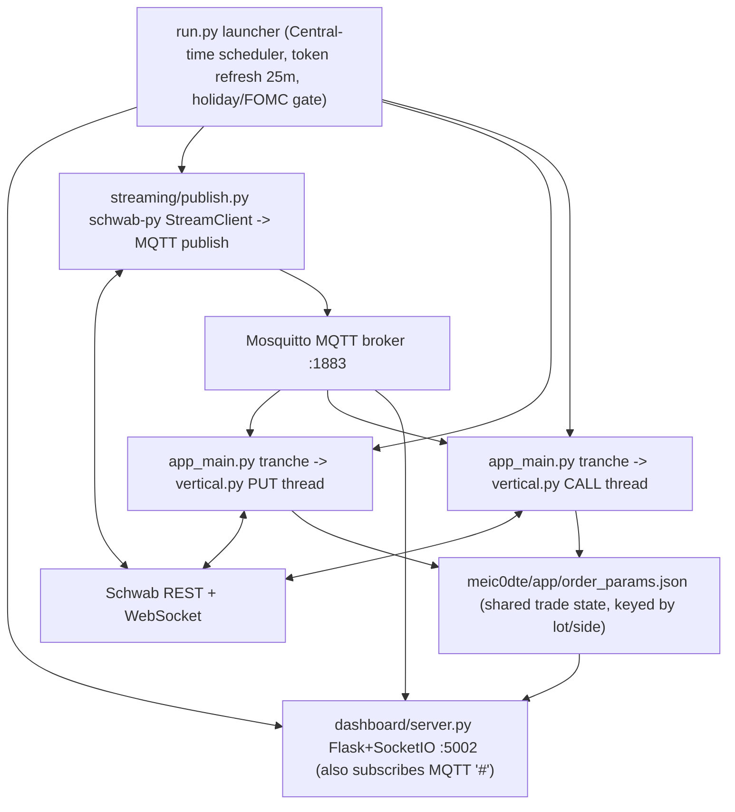
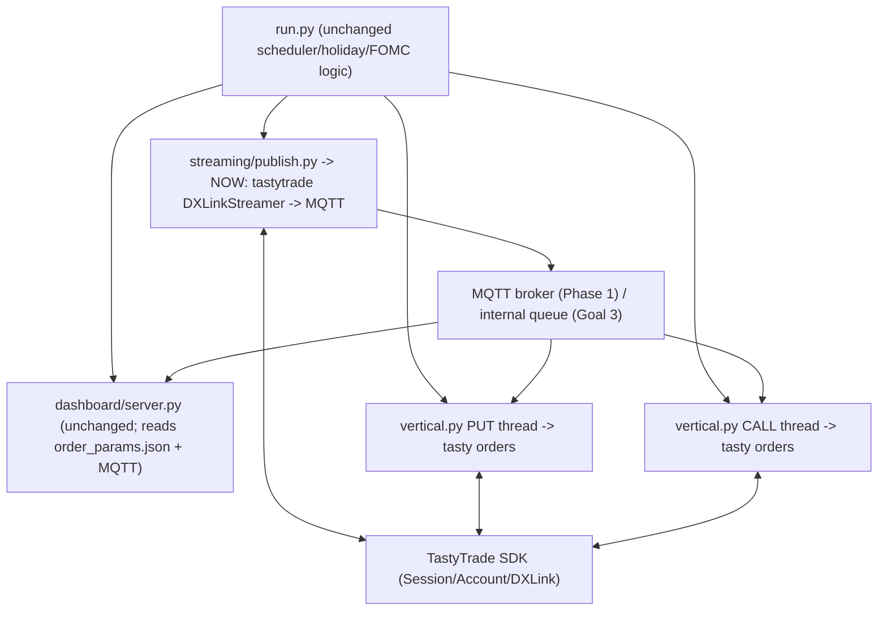

# MEIC -> TastyTrade: Project Plan & Change Document

Version: 1.0
Author: prepared for execution (detail-first, low-deviation)
Scope: Port the Schwab-based **MEIC-with-Dash** bot to **TastyTrade**, keeping the entry-time schedule, the 4-step stop logic, and the dashboard working as-is; then add paper mode, remove MQTT, decouple the stop engine, and generalize to multiple tickers.

> IMPORTANT CONTEXT: The two repos in this workspace are very different in maturity.
> - `MEIC-with-Dash-main/` (friend's repo) is a **complete, working Schwab bot** with real orders, a 4-step stop engine, MQTT streaming, a SQLite-backed Flask+SocketIO dashboard, kill switch, and token auth.
> - `spx-bot-main/` (your repo) is a **paper/simulation scaffold** on TastyTrade. It has the right primitives (tastytrade `Session`/`Account`/`DXLinkStreamer`/`get_option_chain`, a strategy framework, a Flask dashboard) but **does not actually place real orders** — `open_if()`/`close_if()` call `TradeExecutor.place_order(None, ...)` with `simulate_only=True` (see `spx-bot-main/common/trade_execution.py` and `spx-bot-main/strategies/spx_9if_v2/strategy.py`). There are **no real order builders, no stop orders, and no fill monitoring** anywhere in the Tasty repo.
>
> Therefore "translate MEIC to Tasty" is mostly: **keep the MEIC architecture/logic/dashboard and swap the broker layer (Schwab REST + schwab-py streaming) for the tastytrade SDK**, while borrowing proven Tasty primitives from `spx-bot-main`. We are NOT translating the simulation scaffold; we are translating the real Schwab bot onto Tasty.

---

## 0. How to use this document

Each goal below has: (a) what exists today, (b) the target design, (c) exact file-by-file changes with function signatures, (d) edge cases, and (e) concerns/questions. Execute goals in order. Goal 1 is the immediate need; Goals 2-5 are layered on top without breaking Goal 1.

Legend for change actions: **KEEP** (use as-is), **EDIT** (modify in place), **REPLACE** (rewrite body, same role), **NEW** (create), **DROP** (remove/retire).

---

## 1. System understanding (as-is)

### 1.1 MEIC-with-Dash (Schwab) — the source of truth

Process topology (multi-process, MQTT is the IPC glue):



Key facts:
- **Schedule** (`run.py` `TRANCHES` + `meic0dte/app/utilities.py` `get_lot_time()`): 6 tranches/day in Central time — windows 11:14-11:20, 11:59-12:05, 12:29-12:35, 13:14-13:20, 13:44-13:50, 13:59-14:05. Each tranche launches `app_main.py` once.
- **Per tranche** (`meic0dte/app/vertical.py` `tranche()`): spawns two threads, `"P"` and `"C"`, each running `vertical_spread()`. So each tranche = one **iron condor built as two independent vertical credit spreads** (a put spread + a call spread), each managed separately. NOT a single 4-leg order.
- **Open** (`open/openspread.py`, `open/spreadprice.py`, `open/quotes.py`): poll Schwab `/quotes` REST for `$SPX` last, round to nearest 5, scan widths (`SPREAD_WIDTH_MIN..MAX` step `STEP`) and OTM offsets (`OTM_MIN..MAX`) to find a short/long pair whose mark-based credit is within `CREDIT_MIN..CREDIT_MAX`; skip a strike if its long leg is already short in another lot (`check_long_short`). Place a `NET_CREDIT` SINGLE order with 2 legs (`BUY_TO_OPEN` long, `SELL_TO_OPEN` short) via `order/orderdetails.py:open_order` + `order/order.py:place_order`.
- **Fill check** (`open/fillcheck.py:check_openfill`): GET `/accounts/{acct}/orders/{id}`; returns codes 0=working/not filled, 1=filled, 2=rejected, 3=canceled, 4=partial.
- **Stop placement** (`open/fillaction.py:place_stop`): after fill, read the short leg's execution price, compute stop = `2x` short-leg fill price (`STOP_PRCNT_*`), place a single-leg **STOP_LIMIT** `BUY_TO_CLOSE` on the short. Then append both symbols to `streaming/optsymbols.json` so the streamer starts streaming them. Persist everything to `order_params.json` via `utilities.write_open_params_to_file`.
- **Close/stop engine** (`close/closespread.py` -> `close/closetask.py` + `close/streamtask.py`): an asyncio pair. `streamtask` subscribes MQTT to short/long/index/killswitch topics and pushes latest prices into thread-safe `queue.Queue`s. `closetask` loops every 3s and runs `shortclose.short_close()` then (after short closes) `longclose.long_close()`.
- **Dashboard** (`dashboard/server.py` + `db.py` + `templates/index.html`): Flask+SocketIO on :5002 (README says 5001, code says 5002). Reads `order_params.json`, overlays live MQTT prices, computes live P&L, persists to SQLite (`meic_trades.db`), exposes Today/History tabs, start/stop bot, kill switch, manual close, regen token.
- **Auth** (`common/auth/`): Schwab OAuth via `.env` (`SCHWAB_CLIENT_ID/SECRET/ACCT`), `generate_token.py` (interactive), `refresh_token.py` (every 25 min). Token stored at `common/auth/token.json`.

### 1.2 The 4-step stop logic (exact, code-level)

This is the crown jewel to preserve. Mapping your description -> actual code:

1. **Stop on the short at 2x entry, at the get-go** — `open/fillaction.py:place_stop`:
   ```
   short_stop_price = round(round(((short_leg_price - 0.10) * stop_prcnt) / 0.05) * 0.05, 2)   # stop_prcnt = 2.0
   short_limit_price = round(short_stop_price + LIMIT_OFFSET, 2)                                # LIMIT_OFFSET = 0.10
   if short_stop_price >= 2.90: round to 0.10 ticks
   ```
   Order = single-leg STOP_LIMIT `BUY_TO_CLOSE` on the short option.
2. **Monitor breach/fill; close short, then close long** — `close/closetask.py:close_spread_task` loop:
   - Every ~10 iterations (~30s) checks the short stop order fill (`fillcheck.check_fill_status`). If filled -> `short_close_flag=True`.
   - `shortclose.short_close()` watches the live spread price; if `current_spread_price >= stop_price` (or kill switch) it **replaces** the resting stop with a marketable limit (`LMT_CLS`) to force the close.
   - Once `short_close_flag`, `longclose.long_close()` sells the long leg with a limit order (re-pricing/replacing until filled). When the long fills, the side is done and close prices are written to `order_params.json`.
3. **If the long leg trades <= $0.05, switch the short stop to 2x the spread credit** — `close/shortclose.py`:
   ```
   spread_stop_price = round(round((filled_price * stop_prcnt) / 0.05) * 0.05, 2)   # filled_price = spread credit
   if current_long_price <= 0.05 and not short_stoplmt_rplc_flag:   # action "STPLMT_RPLC"
       replace the short stop so its trigger is based on spread_stop_price (+0.20 offset)
   ```
4. **At ~2:51 PM CT, switch to SPX-price-based closing** — `close/shortclose.py` (gated by `t_time >= 14:STRK_CHK_MIN`, `STRK_CHK_MIN = 51`):
   ```
   if call:  short_strike - index <= STRK_IDX_DIFF  -> market BUY_TO_CLOSE short   # STRK_IDX_DIFF = 3
   if put:   index - short_strike <= STRK_IDX_DIFF  -> market BUY_TO_CLOSE short
   ```
   And a hard stop at 15:00 (`closetask` returns and writes close params).

> DISCREPANCY vs your written spec — please confirm desired values (all should become config):
> - You said **"2:55 CT"**; code triggers at **14:51 (2:51 PM CT)** via `STRK_CHK_MIN`.
> - You said **"within $5"**; code uses **3 points** via `STRK_IDX_DIFF`.
> - Hard cutoff is **15:00 CT**.

### 1.3 TastyTrade primitives already proven in `spx-bot-main`

- Auth: `Session(username, password)`, `Account.get(session, acct_no)` (synchronous in tastytrade 10.2.2 — used without `await` in `common/trade_execution.py`).
- Chain: `get_option_chain(session, "SPX")` -> `{expiration_date: [Option, ...]}`; each `Option` has `.strike_price`, `.option_type` ("C"/"P"), `.symbol` (OCC), `.streamer_symbol` (dxfeed, e.g. `.SPXW250527C5910`), and `.build_leg(qty, OrderAction)`.
- Streaming: `async with DXLinkStreamer(session) as s: await s.subscribe(Quote, syms); await s.subscribe(Greeks, syms); await s.subscribe(Trade, [underlying])` then `await s.get_event(Quote)`. The repo's `mids_for_symbols()` is a working snapshot reader; `collect_data.py:stream_and_write` is a working persistent streamer with reconnect.
- Internal queue: `shared_queues.py:SymbolOverwriteQueue` (asyncio) — the building block for Goal 3.

### 1.4 TastyTrade order API (verified against current SDK docs)

```python
from decimal import Decimal
from tastytrade.order import (NewOrder, NewComplexOrder, OrderAction,
                              OrderTimeInForce, OrderType)

# Multi-leg credit spread (sign convention: positive price = CREDIT, negative = DEBIT)
short_leg = short_opt.build_leg(Decimal(qty), OrderAction.SELL_TO_OPEN)
long_leg  = long_opt.build_leg(Decimal(qty),  OrderAction.BUY_TO_OPEN)
entry = NewOrder(time_in_force=OrderTimeInForce.DAY, order_type=OrderType.LIMIT,
                 legs=[short_leg, long_leg], price=Decimal("1.05"))   # +credit
resp = account.place_order(session, entry, dry_run=False)            # PlacedOrderResponse
order_id = resp.order.id

# Single-leg STOP_LIMIT on the short (BUY_TO_CLOSE)
close_leg = short_opt.build_leg(Decimal(qty), OrderAction.BUY_TO_CLOSE)
stop = NewOrder(time_in_force=OrderTimeInForce.DAY, order_type=OrderType.STOP_LIMIT,
                legs=[close_leg], price=Decimal(limit), stop_trigger=Decimal(stop_px))
account.place_order(session, stop, dry_run=False)

# Manage
order.price = Decimal("1.10"); account.replace_order(session, order_id, order)
account.delete_order(session, order_id)
orders = account.get_live_orders(session)   # live + last-24h (filled/cancelled)
```

> VERIFY-ON-EXECUTE: tastytrade pinned at `10.2.2` in `spx-bot-main/requirements.txt`. The docs above reflect the current SDK. Two things the implementer must confirm against 10.2.2 at the start:
> 1. Whether `place_order/replace_order/delete_order/get_live_orders` are sync (as `spx-bot-main` uses them) or async (`await`). Pick one convention repo-wide.
> 2. Whether `OrderType.STOP_LIMIT` uses `stop_trigger=` (some versions used `PriceEffect`/`stop_price`). If 10.2.2 differs, either upgrade tastytrade or adapt the field name. Recommendation: upgrade to the latest tastytrade and re-pin, since the spx-bot order path was never exercised against the broker anyway.

---

## 2. Target architecture (Tasty)

We keep the MEIC repo layout and dashboard, and replace only the broker-touching modules. Recommended approach for Goal 1: **in-place port of `MEIC-with-Dash-main` to Tasty** (call the new tree `meic-tasty/` or a new branch), keeping MQTT for now (Goal 3 removes it).



### 2.1 Symbol-format mapping (critical)

| Concept | Schwab (current) | TastyTrade (target) |
|---|---|---|
| Index quote | REST `/quotes?symbols=$SPX` -> `quote.lastPrice` | `DXLinkStreamer` `Trade`/`Quote` on `"SPX"` |
| VIX | `$VIX` | `"VIX"` |
| Option instrument id | OCC built by string: `f"SPXW  {yymmdd}{C|P}0{strike}000"` (`utilities.create_option_symbol`) | `Option.symbol` from `get_option_chain` (do NOT hand-build) |
| Option stream id | same OCC string, MQTT topic `SCHWAB/<OCC>` | `Option.streamer_symbol` (dxfeed, e.g. `.SPXW...`) |
| Option mark for pricing | `quote.mark` (REST) | mid = (bid+ask)/2 from `Quote`; last = `Trade.price` |
| opt_type from symbol | `short_symbol[-9]` | use `Option.option_type` |
| strike from symbol | `short_symbol[-7:-3]` | use `float(Option.strike_price)` |

> Implication: the string-built symbols (`create_option_symbol`) and `[-9]`/`[-7:-3]` slicing must be **retired** and replaced by carrying `Option` objects (or a small dataclass holding `occ_symbol`, `streamer_symbol`, `strike`, `opt_type`). The dashboard and `order_params.json` already key on stored symbol strings; we keep storing the OCC `Option.symbol` so the dashboard/SQLite stay unchanged, and additionally store `streamer_symbol` for the streamer/close engine.

### 2.2 Quote source decision for open scan (concern)

Schwab gives a synchronous REST `/quotes` call that `spreadprice.get_open_spread_price` calls repeatedly while scanning strikes. Tasty has **no synchronous REST quote**; quotes come from the DXLink websocket. Two options:

- **Option A (recommended): snapshot via DXLink.** Reuse the proven `mids_for_symbols()` pattern from `spx_9if_v2/strategy.py`: build the candidate option `streamer_symbol`s for the scan, open one `DXLinkStreamer`, collect a snapshot of mids, then evaluate credit. Open the chain once per tranche with `get_option_chain` and filter locally instead of REST-scanning.
- **Option B: subscribe to a strike band once** (e.g. +/- 150 pts around ATM for both sides) and read mids from the live cache. Lower latency for the scan loop.

Either way, replace `open/quotes.py` entirely. Recommendation: Option A for Phase 1 (closest to existing scan loop), move to Option B during Goal 3.

---

## 3. GOAL 1 (Immediate): Port MEIC to TastyTrade, dashboard working as-is

### 3.1 Strategy: port-in-place, swap broker layer

Decision: **Do not** try to reshape MEIC into `spx-bot-main`'s `BaseStrategy`. Keep MEIC's structure (it already encodes the schedule + stop logic + dashboard). Replace only Schwab-touching files. Borrow Tasty code patterns from `spx-bot-main`.

### 3.2 File-by-file change list

Auth (`common/auth/`):
- `common/auth/config.py` — **EDIT**: replace Schwab `.env` keys with Tasty creds. New keys: `TT_USERNAME`, `TT_PASSWORD`, `TT_ACCOUNT`, optional `TT_IS_TEST` (cert/sandbox). Keep `.env` loading via `python-dotenv`.
- `common/auth/generate_token.py`, `refresh_token.py`, `util.py` — **REPLACE** with a single `session.py` providing a cached `get_session()` and `get_account()`:
  ```python
  # common/auth/session.py
  from tastytrade import Session, Account
  _session = None; _account = None
  def get_session():
      global _session
      if _session is None or not _session.validate():
          _session = Session(cfg.TT_USERNAME, cfg.TT_PASSWORD, is_test=cfg.TT_IS_TEST)
      return _session
  def get_account():
      global _account
      if _account is None:
          _account = Account.get(get_session(), cfg.TT_ACCOUNT)
      return _account
  ```
  Tasty sessions last ~24h; remove the 25-min Schwab refresh (Tasty re-auth on `validate()` failure). Keep the launcher's background refresh thread but point it at `get_session().validate()`.
- `common/auth/token.json` and Schwab base URLs — **DROP**.

Order layer (`meic0dte/order/`):
- `order/orderdetails.py` — **REPLACE** the 4 dict-builders with tastytrade `NewOrder` builders that accept `Option` objects:
  - `open_spread_order(short_opt, long_opt, qty, credit) -> NewOrder` (LIMIT, `price=+credit`, legs `[SELL_TO_OPEN short, BUY_TO_OPEN long]`).
  - `stop_limit_order(opt, qty, stop_px, limit_px) -> NewOrder` (STOP_LIMIT, single `BUY_TO_CLOSE` leg).
  - `limit_order(action, opt, qty, limit_px) -> NewOrder`.
  - `market_order(action, opt, qty) -> NewOrder` (`OrderType.MARKET`).
- `order/order.py` — **REPLACE** REST calls with SDK calls. Keep the same return contract the callers expect:
  - `place_order(order, lot, log) -> order_id` (call `account.place_order(session, order, dry_run=PAPER)`, return `resp.order.id`).
  - `replace_order(order_id, order, lot, log) -> new_id | 3` (map "already filled/terminal" to the existing sentinel `3`; map errors to `1`/`2`).
  - `cancel_order(order_id, lot, log) -> 1|2` (call `delete_order`; map "FILLED cannot be canceled" -> `2`).

Fill checking (`meic0dte/open/fillcheck.py` and `close/fillcheck.py`):
- **REPLACE** `check_openfill(order_id, ...)` to call `account.get_live_orders(session)` (or `get_order(session, id)` if available in 10.2.2) and map `OrderStatus` -> the existing integer codes:
  - `FILLED -> 1`, `REJECTED -> 2`, `CANCELLED -> 3`, `LIVE/RECEIVED with 0 fills -> 0`, partial -> `4`.
  - Return a dict shaped like the callers need (`order['status']`, `order['filledQuantity']`, `order['remainingQuantity']`, and per-leg fill prices). Build a small adapter so `close/fillcheck.py` and `fillaction.py` keep working with minimal edits:
    - leg fill price extraction: in Schwab it reads `order['orderActivityCollection'][0]['executionLegs']`; in Tasty read `PlacedOrder.legs[i].fills[*].fill_price` and the leg `action` to find SELL_TO_OPEN/BUY_TO_OPEN. Provide `get_leg_fill_price(order, action)` helper.

Open scan (`meic0dte/open/`):
- `open/quotes.py` — **REPLACE** with a Tasty quote module:
  - `get_index_price(session) -> float` (DXLink Trade/Quote on `"SPX"`, round to nearest 5 by caller).
  - `get_pair_mids(session, short_opt, long_opt) -> (short_mid, long_mid)` (DXLink snapshot of the two `streamer_symbol`s; mid = (bid+ask)/2 rounded to nickel).
- `open/spreadprice.py` — **EDIT**: keep the scan algorithm (widths/OTM/credit bounds, `check_long_short`) but source `Option` objects from a per-tranche `get_option_chain(session, "SPX")` filtered by strike, and use `get_pair_mids`. Return `(short_opt, long_opt, spread_credit)` instead of strings.
- `open/openspread.py` — **EDIT**: thread `Option` objects through; `place_order` now takes a `NewOrder`.
- `open/fillaction.py:place_stop` — **EDIT**: keep stop math (2x short-leg fill, offsets, $2.90 tick rule); build the stop via the new `stop_limit_order(short_opt, ...)`; keep writing OCC `Option.symbol` to `order_params.json` and ALSO write `short_streamer`/`long_streamer`. Replace `update_options_symbols([...])` to append the `streamer_symbol`s (for the Tasty streamer subscription file).
- `open/check_vix.py` + `common/vixspx/open_vixspx.py` — **EDIT**: VIX up/down check via DXLink `"VIX"` instead of Schwab REST. (Currently `compare_vix` is computed but not used as a gate — confirm whether you want VIX gating live.)

Close/stop engine (`meic0dte/close/`):
- `close/streamtask.py` — **EDIT** (Phase 1 keeps MQTT): keep subscribing to MQTT topics; only the publisher changes. No logic change needed if topic names are preserved. (Goal 3 replaces this with an internal queue.)
- `close/closetask.py`, `shortclose.py`, `longclose.py`, `strikecheck.py`, `closeorder.py` — **EDIT (light)**: all the stop logic stays; only calls into `order.py`/`orderdetails.py`/`fillcheck.py` change signatures (Option objects + `NewOrder`). The price math, thresholds, queues, and timing are unchanged. Replace symbol slicing (`short_symbol[-9]`, `[-7:-3]`) with stored `opt_type`/`strike` fields read from `order_params.json`.
- `close/closespread.py` — **KEEP** (pure asyncio orchestration over queues).

Streaming (`streaming/`):
- `streaming/publish.py` — **REPLACE** the schwab-py `StreamClient` with a tastytrade `DXLinkStreamer` loop (model on `spx-bot-main/collect_data.py:stream_and_write`, including reconnect/backoff). Behavior to preserve:
  - Read symbol list from `optsymbols.json` (now `streamer_symbol`s), subscribe `Quote` (+ `Trade` for index), and on each tick publish `LAST/mid` to MQTT topic `TOPIC_PREFIX + <symbol>` and `INDEX_TOPIC` for SPX.
  - Honor the kill-switch topic, the 15:00 stop, dynamic symbol add, and the SPX/VIX OHLC CSV writes.
  - DECISION: publish **mid** (matches Schwab "mark" usage) on the option topics; publish SPX **last/mid** on the index topic. Keep the `SCHWAB/` prefix for now (dashboard subscribes to `#` so it is prefix-agnostic; `closetask` uses the config constant). Optionally rename prefix to `TASTY/` in `streaming/config.py` — change in one place.
- `streaming/config.py` — **EDIT**: keep MQTT params; `INDEX_SYMBOL` `$SPX -> SPX`; add a `STREAMER_SYMBOLS` notion if needed. `optsymbols.json` default becomes `{"SYMBOLS": ["SPX"]}` (the DXLink index symbol).
- `streaming/util.py` — **EDIT**: `createClientConnection()` returns a tastytrade `Session` instead of schwab client; keep the Central-time helpers/logger.

Launcher & dashboard:
- `run.py` — **EDIT (minimal)**: keep the scheduler, holiday/FOMC gate, weekend logic. Replace the Schwab token-refresh import/loop with the Tasty `validate()` keep-alive. Everything else (`TRANCHES`, `wait_until`, subprocess spawns) is broker-agnostic and stays.
- `dashboard/server.py`, `db.py`, `templates/index.html`, `meickillswitch.py`, `ondemand_closespread.py` — **KEEP** (no broker calls except kill switch via MQTT). `regen_token` route becomes a no-op or "re-validate session"; update its label.
- `meic0dte/tradingbook/tb_update.py`, `tb_config.py`, `tb_main.py` — **KEEP** (operate purely on `order_params.json`; fee constants may need a Tasty-specific tweak later).
- `meic0dte/app/config.py` — **EDIT**: keep all trade params; add `PAPER = True` (Goal 2) and `IS_TEST` (Tasty cert env); confirm `INDEX_SYMBOL`/`OPTION_SYMBOL` usage now comes from chain not string-build.

Dependencies:
- `requirements.txt` — **EDIT**: drop `schwab-py`, `rauth`; add `tastytrade` (pin to the version you settle on). Keep `paho-mqtt` (Phase 1), `flask`, `flask-socketio`, `openpyxl`, `pandas`, `pandas-market-calendars`, `beautifulsoup4`, `python-dotenv`.

### 3.3 `order_params.json` schema additions (keeps dashboard working)

Per `lot/opt_type`, currently: `date_opened, time_opened, open_order_id, short_symbol, long_symbol, short_open_price, long_open_price, filled_quantity, filled_price, short_close_order_id, short_close_price, long_close_price`.

Add (non-breaking): `short_streamer`, `long_streamer`, `opt_type`, `short_strike` (so close engine and streamer never re-derive from string slicing). Dashboard `build_summary()` and `db.upsert_trade()` continue to read the existing keys unchanged.

### 3.4 Goal 1 acceptance criteria
- `python run.py` starts dashboard + Tasty streamer; tranches fire on schedule (cert/paper account).
- Each tranche opens a put spread and a call spread within credit bounds; a STOP_LIMIT is placed on each short at 2x its fill.
- Stop engine reproduces all 4 steps; hard 15:00 close works.
- Dashboard Today/History tabs, live P&L, kill switch, manual close all function unchanged.

---

## 4. GOAL 2: Paper mode (no orders sent to broker)

Tasty has two distinct "paper" notions; decide which (see questions):
- **Cert/sandbox account**: `Session(..., is_test=True)` -> real API calls to Tastytrade's certification environment (real order objects, fake money). Best fidelity.
- **Local dry-run**: never call `place_order`; simulate fills locally (like `spx-bot-main`'s `simulate_only`). No network risk; lower fidelity.

Design (supports both):
- Add `PAPER` and `IS_TEST` to `meic0dte/app/config.py`.
- In `order/order.py`, gate the SDK call: if `PAPER and not IS_TEST`, return a synthetic `order_id` (e.g. `SIM-<uuid>`) and record an in-memory/JSON simulated order book; `fillcheck` recognizes `SIM-` ids and simulates fills using the latest streamed mid (immediate or threshold-based). If `IS_TEST`, just route to the cert account with `dry_run=False`.
- This isolates ALL broker side-effects to `order/order.py` + `fillcheck.py`, so the stop engine code is identical in paper and live.

Note: If Goal 1 is validated on the **cert account**, Goal 2's local dry-run may be unnecessary (as you suspected). Recommend shipping cert mode first, add local dry-run only if you need to run with markets closed.

---

## 5. GOAL 3 (Medium): Remove MQTT -> internal Python queue

### 5.1 The real constraint
MQTT today is **inter-process** glue: `publish.py`, each `app_main.py` tranche, and `dashboard/server.py` are separate OS processes. A plain `asyncio.Queue`/`queue.Queue` only shares state **within one process**. So "use an internal queue" forces an architecture choice:

- **Option 3A (recommended): collapse to a single process.** Run the streamer, all tranche/stop tasks, and a state publisher as asyncio tasks in one process (the `spx-bot-main/main.py` model). Replace MQTT pub/sub with `shared_queues.py`-style `SymbolOverwriteQueue` + a shared `live_prices` dict. The dashboard then reads state via an HTTP endpoint (`/api/summary`) served from the same process (or a thin file/SQLite hand-off) instead of subscribing to MQTT.
  - Pros: no broker, ideal for Google free tier (single container/process), simpler deploy.
  - Cons: lose process isolation (one crash affects all); must convert the thread-per-side model to asyncio tasks; the launcher's subprocess model is replaced by an in-process scheduler.
- **Option 3B: keep multiple processes, swap MQTT for another local IPC** (UNIX socket / localhost ZeroMQ / Redis / a watched file). This keeps isolation but reintroduces a dependency (defeats part of the goal). Only pick this if process isolation is a hard requirement.

### 5.2 Recommended Goal-3 plan (Option 3A)
1. Introduce a `bus.py` with a process-local pub/sub: `prices: SymbolOverwriteQueue`, `live_prices: dict`, `events: asyncio.Queue` (kill switch, symbol-add).
2. Convert `streaming/publish.py` into an async `price_feed()` task that writes to `bus.prices`/`bus.live_prices` instead of MQTT.
3. Convert `close/streamtask.py` to read from `bus` instead of MQTT (drop `paho`).
4. Convert `vertical.tranche()` thread-per-side into asyncio tasks scheduled by an in-process scheduler that replaces `run.py`'s subprocess spawns (keep the tranche windows + holiday/FOMC gate).
5. Dashboard: replace its `_mqtt_loop` with a read of the in-process `build_summary()` via HTTP (run dashboard in same process via a thread, or expose `/api/summary` and have the existing SocketIO push from in-proc state). `order_params.json` remains the persisted source of truth, so most of `server.py` is unchanged.
6. Remove `paho-mqtt`, Mosquitto from setup docs.

> This overlaps heavily with Goal 4 — do Goal 4's stop-process design first if you want to keep stops in a separate process, OR commit to single-process here. These two goals must be reconciled (see Section 7).

---

## 6. GOAL 4 (Longer): Decouple the stop engine into its own process keyed by stop order #

### 6.1 Target
A standalone `stop_manager.py` process that:
- Watches a directory of **per-trade JSON files** (one file per opened spread) instead of the single shared `order_params.json`. Suggested path: `meic0dte/trades/<date>/<lot>_<side>_<short_close_order_id>.json`. The **stop order id is the key**.
- Owns the entire 4-step stop lifecycle for every open trade, polling Tasty `get_live_orders` for fills and reading prices from the price feed.
- Lets each tranche/open action be **fire-and-forget**: `vertical_spread()` opens the spread, places the initial stop, writes the per-trade JSON, and exits. It does NOT keep a thread/process alive per trade for closing. This removes the "N threads/processes per MEIC trade" problem.

### 6.2 Design
- **Trade record (per file), keyed by `short_close_order_id`:** all of `order_params.json`'s per-side fields + `streamer_symbol`s + `opt_type` + `short_strike` + a `stop_state` enum (`OPEN`, `SPREAD_STOP` (step 3 done), `STRIKE_MODE` (step 4), `SHORT_CLOSED`, `LONG_CLOSED`, `DONE`).
- **`stop_manager.py` main loop:**
  1. Scan trade dir; load all non-`DONE` records into memory keyed by stop id.
  2. Subscribe the price feed once for the union of all short/long/index streamer symbols.
  3. For each record run the existing `shortclose`/`longclose`/`strikecheck` logic (refactored to operate on a record dict + price snapshot, not queues). Persist state transitions back to the per-trade file (atomic write, reuse `spx-bot-main/common/data_utils.py:save_json_safe`).
  4. On `LONG_CLOSED`, mark `DONE`, write close prices; `tb_update`/dashboard pick it up.
- **Concurrency:** one process, one event loop, one price subscription, N records — replaces N threads. Stops are idempotent: keying by stop order id means a restart re-reads files and resumes (crash recovery for free).
- **Aggregation with `order_params.json`:** keep writing/merging into `order_params.json` for dashboard compatibility, OR migrate the dashboard to read the per-trade dir. Recommended: have `stop_manager` also upsert `order_params.json` so the dashboard is untouched in this phase.

### 6.3 Reference
The Perplexity design you linked (`perplexity.ai/search/1fe1ca86-...`) is not retrievable from here. If it contains a specific file/record schema you want, paste it and I'll align Section 6.1-6.2 exactly.

---

## 7. GOAL 5 (Long term): Generalize to multiple tickers/strategies

- Promote `meic0dte/app/config.py` per-instrument constants into an **instrument registry** (list of dicts): `{underlying, streamer_index_symbol, option_root, tick, widths, otm, credit bounds, stop %, tranche schedule, strike-mode thresholds}`.
- Make the open scan, order builders, and stop engine **instrument-agnostic** (they already only need: an index price, a way to enumerate option strikes, `Option` objects, and price snapshots — all provided generically by tastytrade `get_option_chain`/DXLink).
- The scheduler iterates over enabled (instrument, strategy) tuples; `stop_manager` already keys by stop order id so it naturally handles trades across tickers.
- Strategy abstraction: define a minimal `Strategy` protocol (`build_entries(chain, index_px) -> [SpreadSpec]`, `manage(record, prices) -> actions`) so MEIC is one implementation and others (e.g. a single 9-IF, a butterfly) can be added without touching the engine. This is where adopting `spx-bot-main/strategies/base_strategy.py` becomes worthwhile.

---

## 8. Cross-cutting concerns & open questions

Reconciliation issues (need your call):
1. **Goal 3 vs Goal 4 architecture.** Single-process (Goal 3A) and "separate stop process" (Goal 4) pull in opposite directions. Recommended end-state: **two processes** — (a) feed+scheduler+dashboard, (b) `stop_manager` — communicating via the **per-trade JSON files + Tasty order polling**, with NO MQTT and NO in-memory cross-process queue. That satisfies "remove MQTT" and "decouple stops" together. Confirm you're OK with file-based hand-off as the IPC (it doubles as crash recovery).
2. **tastytrade version / async.** Confirm we may upgrade `tastytrade` past 10.2.2 and adopt whichever (sync/async) the latest uses repo-wide. The spx-bot order path was never run, so there's no real regression risk.

Trading-logic confirmations (all become config, defaults shown):
3. **Strike-mode time**: 14:51 (code) vs **14:55** (your spec). Default to your spec 14:55?
4. **Strike-mode distance**: 3 pts (code) vs **5 pts** (your spec). Default to 5?
5. **VIX gate**: `compare_vix` exists but isn't used to block entries. Should VIX up/down gate tranche entries, or stay informational?
6. **Wrapper vs raw**: you're open to either. Recommendation: **use the `tastytrade` SDK wrapper** (already proven in spx-bot, less code, official). Confirm.
7. **Live vs paper for first run**: ship on Tasty **cert/sandbox** (`is_test=True`) first? Then flip to live after validation?
8. **Quantity/credit/width defaults**: keep MEIC defaults (`QUANTITY=1`, width 25-35, credit 0.90-1.85, stop 2x)? Tasty SPX option chains and fills may warrant different credit bounds — confirm or we tune during cert testing.
9. **Index symbol**: confirm Tasty streams SPX as `"SPX"` for your account entitlements (some accounts use `SPXW`/futures). We verify during cert testing.
10. **Dashboard port**: README says 5001, code says 5002. Keep 5002? And keep the `SCHWAB/` MQTT prefix or rename to `TASTY/`?

Risk notes:
- The `spx-bot-main` order path is unproven against the broker; treat all Tasty order/stop code as **new** and validate each call (open, stop_limit, replace, cancel, market close) on the cert account before trusting the full loop.
- Negative/positive price sign convention (Tasty: + = credit) is the opposite mental model from Schwab's explicit `NET_CREDIT` + positive price string; the open-order builder must use a **positive** Decimal for credit and the close (buy-to-close) a **positive debit**? — verify sign on a cert dry-run (`dry_run=True`) before going live.
- SPX 0DTE strikes are 5-wide; ensure `get_option_chain` returns the 0DTE `SPXW` expiration and that `pick_0dte`-style selection (from `spx_9if_v2`) is reused.

---

## 9. Suggested execution milestones

1. M0 — Spike (0.5d): confirm tastytrade version, run a `dry_run=True` open spread + a STOP_LIMIT on cert; confirm sign conventions and status codes.
2. M1 — Auth + order/fill adapters (Goal 1 core): `session.py`, `orderdetails.py`, `order.py`, `fillcheck.py` adapters with cert account.
3. M2 — Open scan + stop placement on Tasty (`spreadprice`, `openspread`, `fillaction`, quotes module).
4. M3 — Streamer -> MQTT on Tasty (`streaming/publish.py`), close engine wired (`closetask` et al.), dashboard verified end-to-end on cert.
5. M4 — Goal 2 paper toggle hardened.
6. M5 — Goal 3 (de-MQTT) per Section 5/7 decision.
7. M6 — Goal 4 `stop_manager.py` + per-trade JSON.
8. M7 — Goal 5 instrument registry + strategy protocol.

---

## 10. Appendix: exact source references

- Schedule: `MEIC-with-Dash-main/run.py` (TRANCHES), `meic0dte/app/utilities.py:get_lot_time`.
- Open scan/credit: `meic0dte/open/spreadprice.py`, `open/quotes.py`, `open/openspread.py`.
- Order builders / REST: `meic0dte/order/orderdetails.py`, `order/order.py`.
- Stop step 1: `meic0dte/open/fillaction.py:place_stop`.
- Stop steps 2-4: `meic0dte/close/closetask.py`, `close/shortclose.py`, `close/longclose.py`, `close/strikecheck.py`, `close/streamtask.py`.
- Fills: `meic0dte/open/fillcheck.py`, `close/fillcheck.py`.
- Streaming/MQTT: `streaming/publish.py`, `streaming/config.py`, `streaming/util.py`, `streaming/optsymbols.json`.
- Dashboard/DB: `dashboard/server.py`, `dashboard/db.py`, `dashboard/templates/index.html`, `dashboard/bot_status.json`.
- Auth: `common/auth/config.py`, `generate_token.py`, `refresh_token.py`, `common/config.py` (holidays/FOMC).
- Tasty primitives to reuse: `spx-bot-main/strategies/spx_9if_v2/strategy.py` (`mids_for_symbols`, chain/leg selection), `spx-bot-main/collect_data.py` (persistent DXLink stream), `spx-bot-main/shared_queues.py` (internal queue), `spx-bot-main/common/data_utils.py` (`save_json_safe`).
- Tasty order API: tastytrade SDK docs (Orders: place/replace/delete/get_live_orders, NewOrder, NewComplexOrder OCO/OTOCO, build_leg, sign convention).
